### Escuela Colombiana de Ingeniería
### Arquitecturas de Software - ARSW
## Ejercicio Introducción al paralelismo - Hilos - Caso BlackListSearch
## Integrantes: Tomas Quiceno Ostos, Deisy Guzman

### Dependencias:
####   Lecturas:
*  [Threads in Java](http://beginnersbook.com/2013/03/java-threads/)  (Hasta 'Ending Threads')
*  [Threads vs Processes]( http://cs-fundamentals.com/tech-interview/java/differences-between-thread-and-process-in-java.php)

### Descripción
  Este ejercicio contiene una introducción a la programación con hilos en Java, además de la aplicación a un caso concreto.
  

**Parte I - Introducción a Hilos en Java**

1. De acuerdo con lo revisado en las lecturas, complete las clases CountThread, para que las mismas definan el ciclo de vida de un hilo que imprima por pantalla los números entre A y B.
2. Complete el método __main__ de la clase CountMainThreads para que:
	1. Cree 3 hilos de tipo CountThread, asignándole al primero el intervalo [0..99], al segundo [99..199], y al tercero [200..299].
	2. Inicie los tres hilos con 'start()'.
	3. Ejecute y revise la salida por pantalla. 
	4. Cambie el incio con 'start()' por 'run()'. Cómo cambia la salida?, por qué?.
   
**Solución Parte I**

Se implementó la clase `CountThread` cuyo `run()` itera e imprime los números del intervalo [A,B] recibido en el constructor. En `CountThreadsMain` se añadió el método `countInThree(int a,int b)` que valida que `b >= a` (lanza `IllegalArgumentException` si no), calcula `total = (b-a)/3` y construye tres `CountThread` con los subintervalos resultantes, arrancándolos con `start()` para que se ejecuten en paralelo. La división del rango en tres partes y el uso de `start()` permite la ejecución concurrente de las tres tareas.

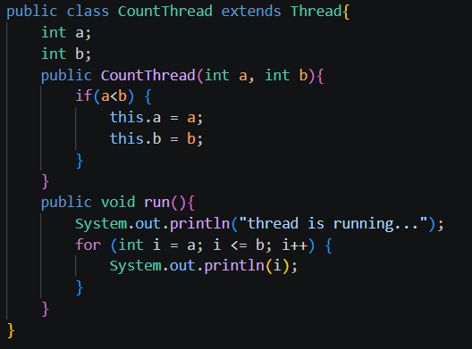

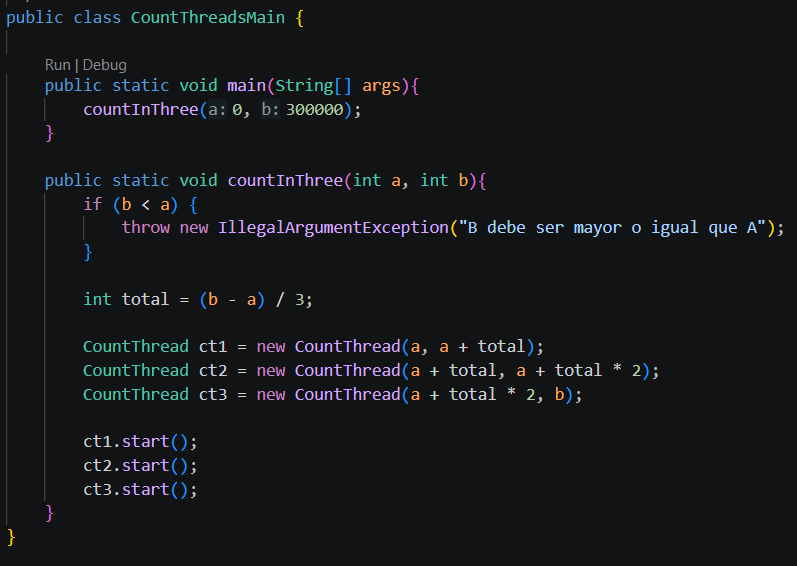

***Resultado hilos iniciados con 'start()'***

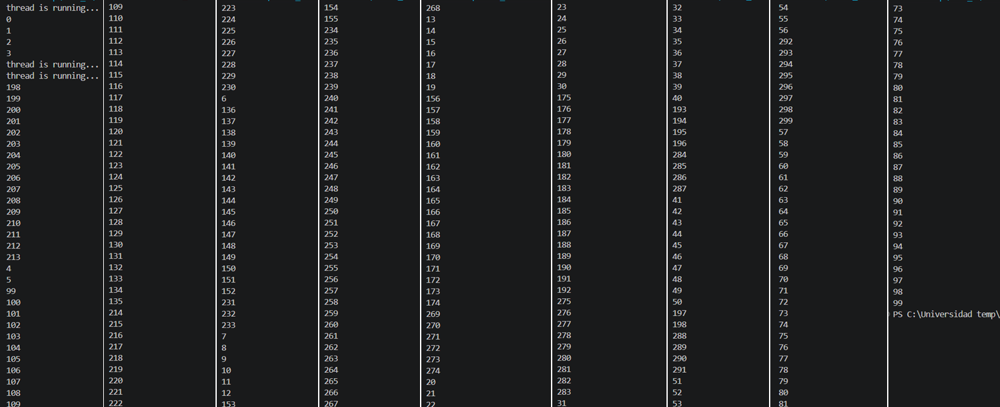

***Resultado hilos iniciados con 'run()'***

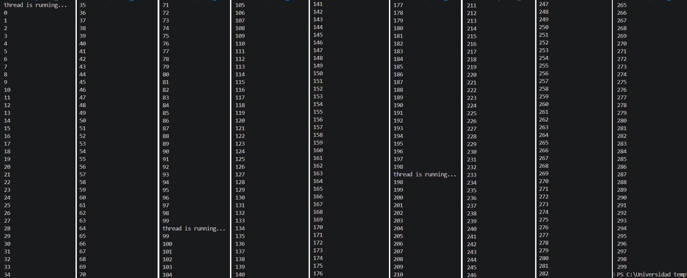

***Cómo y por qué cambia la salida?***

En el caso de la salida con `start()` podemos notar que se desordenan los números al imprimirse, mientras que en el caso de `run()` sí se imprimen en orden secuencial, esto sucede porque llamar a start() crea y arranca un nuevo hilo gestionado por la JVM; la JVM llama a run() de ese objeto en ese hilo nuevo y la ejecución ocurre concurrentemente respecto al hilo que llamó a start(). En cambio, llamar directamente a run() no crea ningún hilo nuevo: simplemente ejecuta el método run() como una llamada normal en el mismo hilo que hizo la llamada.

Con start() las tres instancias imprimen desde hilos diferentes y el planificador del SO/JVM intercalará las salidas (orden no determinista). Con run() todas las impresiones se ejecutan secuencialmente en el hilo principal, respetando el orden de llamadas y por eso la salida aparece ordenada.

**Parte II - Ejercicio Black List Search**

Para un software de vigilancia automática de seguridad informática se está desarrollando un componente encargado de validar las direcciones IP en varios miles de listas negras (de host maliciosos) conocidas, y reportar aquellas que existan en al menos cinco de dichas listas. 

Dicho componente está diseñado de acuerdo con el siguiente diagrama, donde:

- HostBlackListsDataSourceFacade es una clase que ofrece una 'fachada' para realizar consultas en cualquiera de las N listas negras registradas (método 'isInBlacklistServer'), y que permite también hacer un reporte a una base de datos local de cuando una dirección IP se considera peligrosa. Esta clase NO ES MODIFICABLE, pero se sabe que es 'Thread-Safe'.

- HostBlackListsValidator es una clase que ofrece el método 'checkHost', el cual, a través de la clase 'HostBlackListDataSourceFacade', valida en cada una de las listas negras un host determinado. En dicho método está considerada la política de que al encontrarse un HOST en al menos cinco listas negras, el mismo será registrado como 'no confiable', o como 'confiable' en caso contrario. Adicionalmente, retornará la lista de los números de las 'listas negras' en donde se encontró registrado el HOST.

Al usarse el módulo, la evidencia de que se hizo el registro como 'confiable' o 'no confiable' se dá por lo mensajes de LOGs:

INFO: HOST 205.24.34.55 Reported as trustworthy

INFO: HOST 205.24.34.55 Reported as NOT trustworthy

Al programa de prueba provisto (Main), le toma sólo algunos segundos análizar y reportar la dirección provista (200.24.34.55), ya que la misma está registrada más de cinco veces en los primeros servidores, por lo que no requiere recorrerlos todos. Sin embargo, hacer la búsqueda en casos donde NO hay reportes, o donde los mismos están dispersos en las miles de listas negras, toma bastante tiempo.

Éste, como cualquier método de búsqueda, puede verse como un problema [vergonzosamente paralelo](https://en.wikipedia.org/wiki/Embarrassingly_parallel), ya que no existen dependencias entre una partición del problema y otra.

Para 'refactorizar' este código, y hacer que explote la capacidad multi-núcleo de la CPU del equipo, realice lo siguiente:

1. Cree una clase de tipo Thread que represente el ciclo de vida de un hilo que haga la búsqueda de un segmento del conjunto de servidores disponibles. Agregue a dicha clase un método que permita 'preguntarle' a las instancias del mismo (los hilos) cuantas ocurrencias de servidores maliciosos ha encontrado o encontró.

2. Agregue al método 'checkHost' un parámetro entero N, correspondiente al número de hilos entre los que se va a realizar la búsqueda (recuerde tener en cuenta si N es par o impar!). Modifique el código de este método para que divida el espacio de búsqueda entre las N partes indicadas, y paralelice la búsqueda a través de N hilos. Haga que dicha función espere hasta que los N hilos terminen de resolver su respectivo sub-problema, agregue las ocurrencias encontradas por cada hilo a la lista que retorna el método, y entonces calcule (sumando el total de ocurrencuas encontradas por cada hilo) si el número de ocurrencias es mayor o igual a _BLACK_LIST_ALARM_COUNT_. Si se da este caso, al final se DEBE reportar el host como confiable o no confiable, y mostrar el listado con los números de las listas negras respectivas. Para lograr este comportamiento de 'espera' revise el método [join](https://docs.oracle.com/javase/tutorial/essential/concurrency/join.html) del API de concurrencia de Java. Tenga también en cuenta:

	* Dentro del método checkHost Se debe mantener el LOG que informa, antes de retornar el resultado, el número de listas negras revisadas VS. el número de listas negras total (línea 60). Se debe garantizar que dicha información sea verídica bajo el nuevo esquema de procesamiento en paralelo planteado.

	* Se sabe que el HOST 202.24.34.55 está reportado en listas negras de una forma más dispersa, y que el host 212.24.24.55 NO está en ninguna lista negra.

**Solución Parte II**

Se paralelizó la validación dividiendo el conjunto de servidores en N subrangos y asignando cada subrango a un hilo BlackListSearchThread. El método checkHost(String ipaddress, int N) valida y ajusta N, crea los hilos con los índices de inicio y fin adecuados, los arranca con start() y espera su finalización con join(). Tras el join se agregan las listas encontradas por cada hilo, se suma el total verificado y se decide el reporte usando el umbral BLACK_LIST_ALARM_COUNT, manteniendo el log que muestra Checked Black Lists: X of Y. La fachada HostBlacklistsDataSourceFacade no se modifica y se usa de forma segura desde múltiples hilos.

***Creación y particionado, arranque-join:*** 

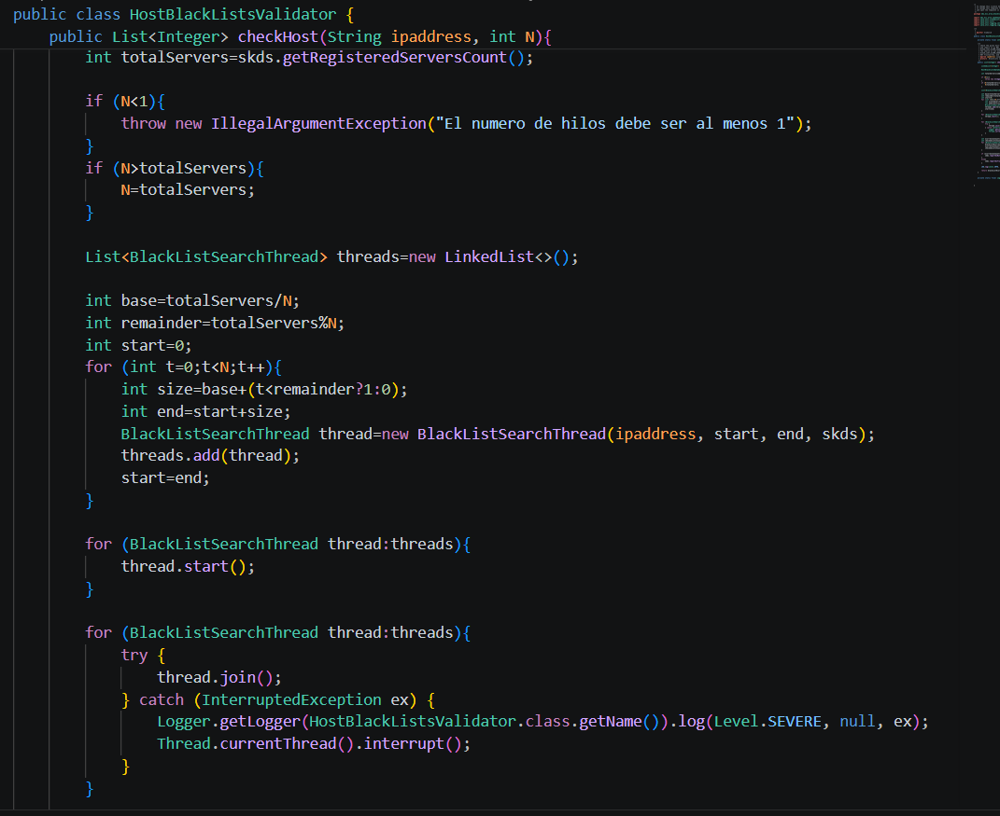

***Agregación de resultados y log final:***

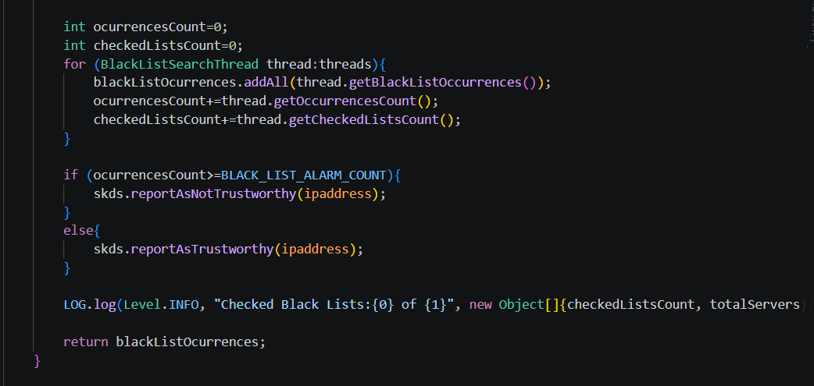

***Lógica del worker (run):***

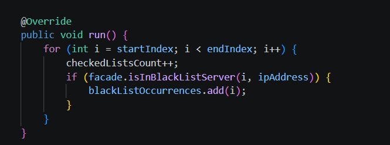

***Clase Main usada para pruebas:***

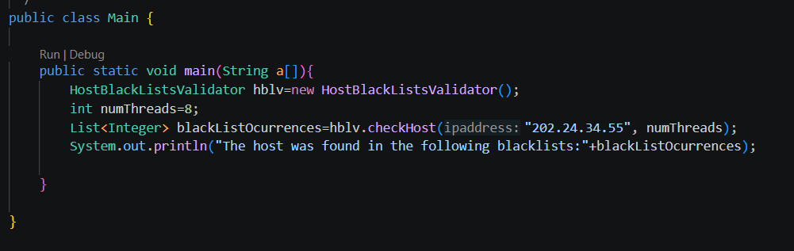

***Prueba de ejecución***

Validación con la IP 202.24.34.55. y `numThreads = 8`. Las ocurrencias se encuentran distribuidas a lo largo de todo el espacio de servidores, por lo que los hilos realizan la búsqueda exhaustiva en sus respectivos segmentos. Al finalizar, se consolida la información y el log final (`Checked Black Lists: 80000 of 80000`) demuestra que la paralelización abarcó la totalidad de las listas correctamente.

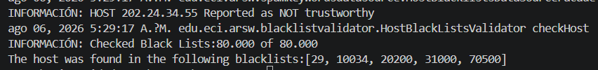

**Parte II.I Para discutir la próxima clase (NO para implementar aún)**

La estrategia de paralelismo antes implementada es ineficiente en ciertos casos, pues la búsqueda se sigue realizando aún cuando los N hilos (en su conjunto) ya hayan encontrado el número mínimo de ocurrencias requeridas para reportar al servidor como malicioso. Cómo se podría modificar la implementación para minimizar el número de consultas en estos casos?, qué elemento nuevo traería esto al problema?

**Parte III - Evaluación de Desempeño**

A partir de lo anterior, implemente la siguiente secuencia de experimentos para realizar las validación de direcciones IP dispersas (por ejemplo 202.24.34.55), tomando los tiempos de ejecución de los mismos (asegúrese de hacerlos en la misma máquina):

1. Un solo hilo.
2. Tantos hilos como núcleos de procesamiento (haga que el programa determine esto haciendo uso del [API Runtime](https://docs.oracle.com/javase/7/docs/api/java/lang/Runtime.html)).
3. Tantos hilos como el doble de núcleos de procesamiento.
4. 50 hilos.
5. 100 hilos.

Al iniciar el programa ejecute el monitor jVisualVM, y a medida que corran las pruebas, revise y anote el consumo de CPU y de memoria en cada caso. 

Con lo anterior, y con los tiempos de ejecución dados, haga una gráfica de tiempo de solución vs. número de hilos. Analice y plantee hipótesis con su compañero para las siguientes preguntas (puede tener en cuenta lo reportado por jVisualVM):

**Solución Parte III**

Para analizar el impacto del paralelismo en el tiempo de respuesta, se ejecutó una serie de pruebas validando la dirección IP `202.24.34.55` (búsqueda dispersa), midiendo los tiempos de ejecución y monitoreando el consumo de recursos de la máquina virtual con VisualVM.

***Primer caso (1 hilo)***

Monitoreo en VisualLVM

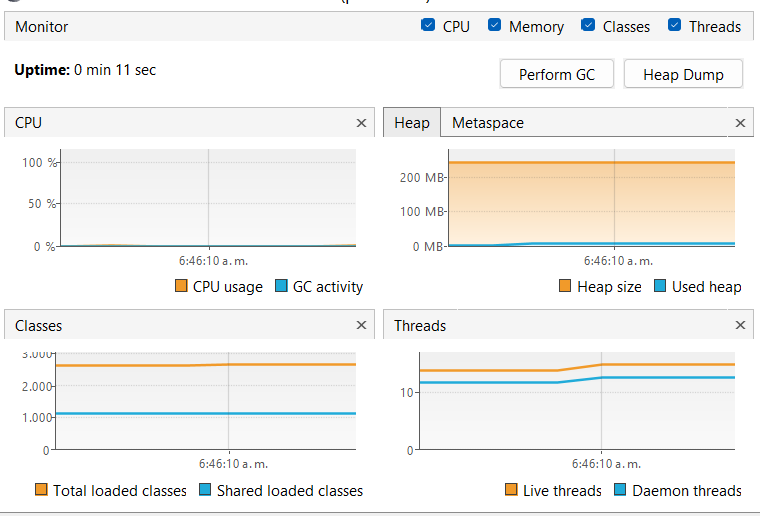

Tiempo de ejecución: 249,295 ms

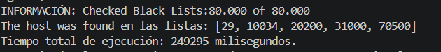

***Segundo caso (Tantos como núcleos, 8 hilos)***

Monitoreo en VisualLVM

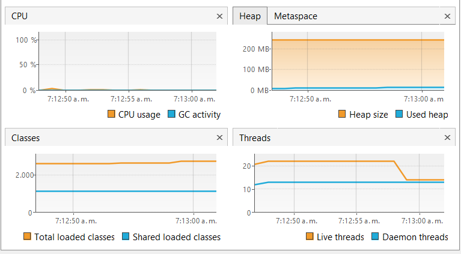

Tiempo de ejecución: 15,268 ms

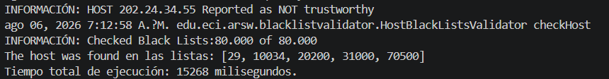

***Tercer caso (Doble de núcleos, 16 hilos)***

Monitoreo en VisualLVM

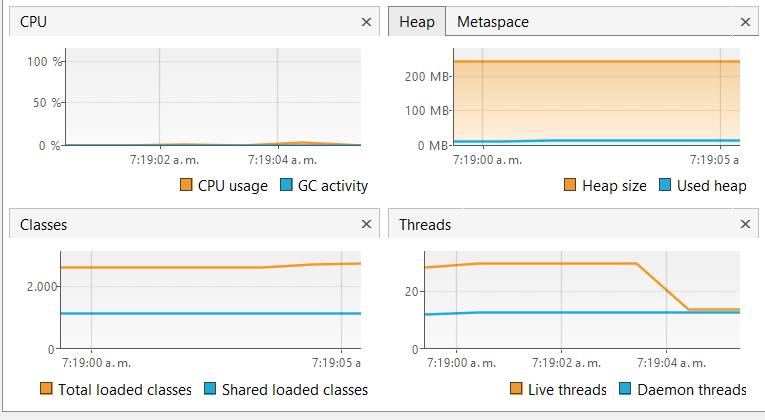

Tiempo de ejecución: 7,715 ms

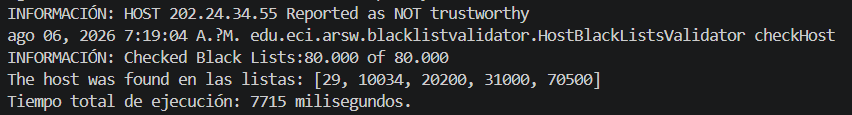

***Cuarto caso (50 hilos)***

Monitoreo en VisualLVM

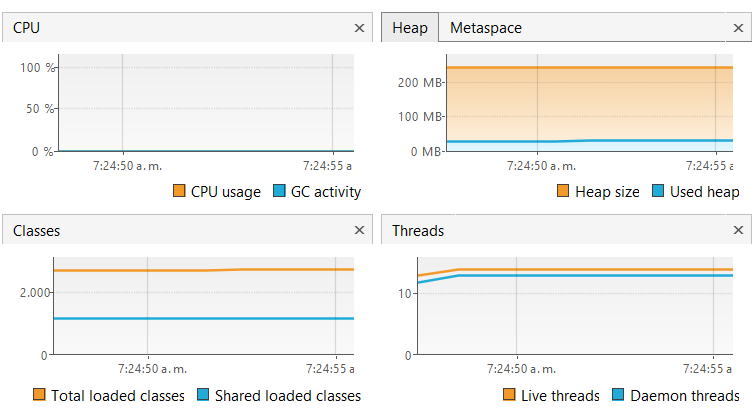

Tiempo de ejecución: 2,573 ms

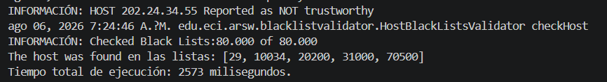

***Quinto caso (100 hilos)***

Monitoreo en VisualLVM

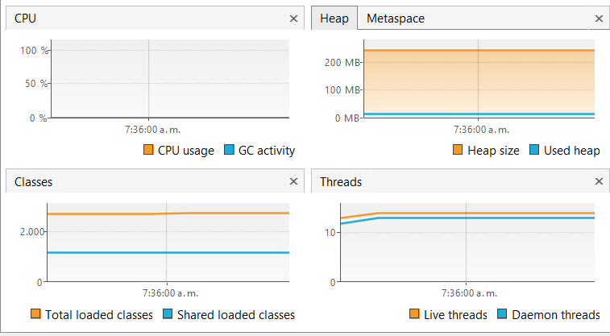

Tiempo de ejecución: 1,346 ms

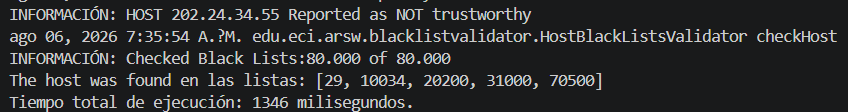

***Gráfica tomando los hilos y tiempos de cada caso***

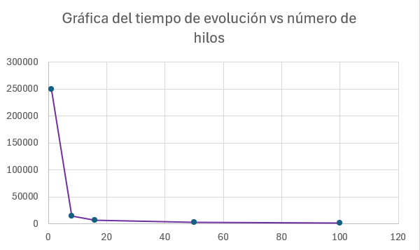

La gráfica muestra el impacto del paralelismo en el rendimiento del programa. Se observa una reducción drástica en el tiempo de ejecución al pasar de 1 a 8 hilos, momento en el que se aprovechan al máximo los núcleos físicos del procesador. A partir de los 16 hilos, la curva comienza a aplanarse de forma significativa. Aunque el tiempo total sigue disminuyendo en las pruebas con 50 y 100 hilos, la mejora se vuelve cada vez más marginal. Este comportamiento evidencia visualmente el principio de la Ley de Amdahl: la mejora del rendimiento tiende a un límite asintótico debido a la sobrecarga (overhead) que genera la creación, el cambio de contexto y la gestión concurrente de múltiples hilos por parte del sistema operativo.

**Parte IV - Ejercicio Black List Search**

1. Según la [ley de Amdahls](https://www.pugetsystems.com/labs/articles/Estimating-CPU-Performance-using-Amdahls-Law-619/#WhatisAmdahlsLaw?):

	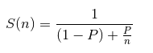, donde _S(n)_ es el mejoramiento teórico del desempeño, _P_ la fracción paralelizable del algoritmo, y _n_ el número de hilos, a mayor _n_, mayor debería ser dicha mejora. Por qué el mejor desempeño no se logra con los 500 hilos?, cómo se compara este desempeño cuando se usan 200?. 

2. Cómo se comporta la solución usando tantos hilos de procesamiento como núcleos comparado con el resultado de usar el doble de éste?.

3. De acuerdo con lo anterior, si para este problema en lugar de 100 hilos en una sola CPU se pudiera usar 1 hilo en cada una de 100 máquinas hipotéticas, la ley de Amdahls se aplicaría mejor?. Si en lugar de esto se usaran c hilos en 100/c máquinas distribuidas (siendo c es el número de núcleos de dichas máquinas), se mejoraría?. Explique su respuesta.

**Solución Parte IV**

Para responder estas preguntas se graficó la ley de Amdahl en GeoGebra con `P = 0.95`, junto con la curva de eficiencia `E(n) = S(n)/n`:

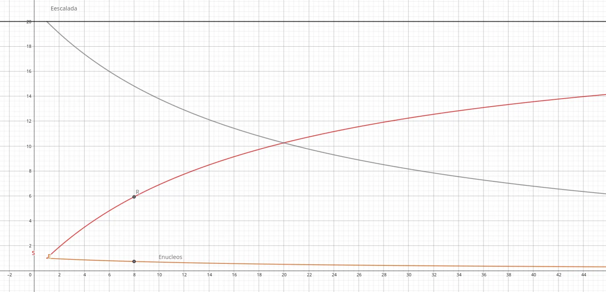

| Elemento de la gráfica | Significado |
| --- | --- |
| Techo (línea negra) = 20 | Límite `1/(1−P)`. El *speedup* nunca lo supera, por más hilos que se usen. |
| Curva de *speedup* (roja) | Sube rápido al inicio y luego se aplana pegándose al techo. |
| Punto `R = (8, 5.93)` | *Speedup* teórico alcanzado con los 8 núcleos de la máquina. |
| Punto `Enucleos = (8, 0.74)` | Eficiencia con 8 hilos (74%). |
| Curva de eficiencia (gris) | Empieza en 100% y cae continuamente al agregar hilos. |

***1. ¿Por qué el mejor desempeño no se logra con los 500 hilos?***

Porque en la fórmula _n_ representa unidades que corren en paralelo **de verdad**, no simplemente hilos lanzados. La máquina tiene solo 8 núcleos, así que el *speedup* real se topa en `R ≈ 5.93×`. Pasados esos 8 núcleos, los 492 hilos restantes no corren en paralelo: se turnan la CPU por *time-slicing* y solo agregan *overhead* (cambios de contexto, contención de memoria y caché).

Además, la curva ya está pegada al techo de 20, un límite infranqueable impuesto por la fracción serial `(1−P) = 0.05`. Por eso más hilos no mejoran nada: el paralelismo real está topado por el hardware y el modelo por el techo.

***¿Cómo se compara este desempeño cuando se usan 200?***

Casi idéntico. Tanto 200 como 500 caen en la zona plana de la curva, así que sus *speedups* teóricos son prácticamente iguales:

| Hilos | *Speedup* teórico `S(n)` con P = 0.95 |
| --- | --- |
| 8 | ≈ 5.93 |
| 200 | ≈ 18.3 |
| 500 | ≈ 19.3 |

Apenas un +5% pese a más que duplicar los hilos: son rendimientos decrecientes puros. Y como en la práctica los 300 hilos adicionales solo suman sobrecosto de conmutación sin aportar paralelismo real, 500 hilos rinde igual o incluso peor que 200: se paga más *overhead* por una mejora teórica que ni siquiera aparece. La curva de eficiencia lo confirma: con 8 hilos ya está en 74% y hacia los cientos se desploma por debajo del 10%, es decir, cada hilo extra aporta cada vez menos.

***2. Tantos hilos como núcleos vs. el doble de núcleos***

Usar tantos hilos como núcleos (8 hilos en 8 núcleos) es el punto óptimo para este problema, que es *CPU-bound*: cada hilo tiene su propio núcleo, hay paralelismo real y el *overhead* de conmutación es mínimo. Es justo el punto `R` de la gráfica, donde se alcanza el máximo *speedup* práctico.

Usar el doble (16 hilos en 8 núcleos) hace que dos hilos compitan por cada núcleo. Como los núcleos ya estaban saturados con 8 hilos, los 8 adicionales no aportan paralelismo real: solo agregan cambios de contexto. Por eso el desempeño no mejora y suele quedar igual o levemente peor.

***3. 100 hilos en una CPU vs. 1 hilo en 100 máquinas***

Sí, la ley se aplicaría mejor. El problema con 100 hilos en una sola CPU es que esa máquina tiene pocos núcleos (8), así que los 100 hilos no corren en paralelo: se turnan la CPU y la mayoría solo agrega *overhead*. En cambio, con 100 máquinas de 1 hilo cada una hay 100 procesadores realmente independientes, cada uno trabajando de verdad al mismo tiempo. Ahí el _n_ de la fórmula sí corresponde a paralelismo real, que es justo lo que Amdahl asume. Por eso la ley se cumple mucho mejor en este escenario que apilando hilos en una CPU que no da abasto.

***¿Y con c hilos en 100/c máquinas?***

Sí, y de hecho es la forma más lógica de organizarlo. Si cada máquina tiene _c_ núcleos, lo natural es ponerle _c_ hilos, porque ese es justamente el punto óptimo de la pregunta 2: cada hilo tiene su propio núcleo y ninguno queda peleando por CPU. Repartiendo así, con `100/c` máquinas de _c_ hilos cada una, seguimos teniendo las mismas ~100 unidades de procesamiento trabajando en paralelo, pero ahora distribuidas de forma que ninguna máquina queda ni sobrecargada ni desaprovechada.

La diferencia se ve mejor comparando los dos escenarios: en el primero teníamos 100 máquinas usando solo 1 de sus núcleos, lo que deja el resto del hardware ocioso; en el segundo tenemos menos máquinas, pero cada una con todos sus núcleos ocupados. Ambos arreglos dan alrededor de 100 hilos reales corriendo al tiempo, solo que el segundo aprovecha mucho mejor los recursos disponibles. Por eso es la manera más eficiente de montarlo, y es exactamente cómo funcionan los clústeres reales: varias máquinas, cada una con varios núcleos trabajando a pleno.
	,

